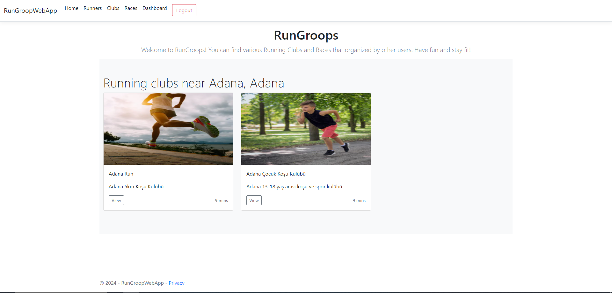
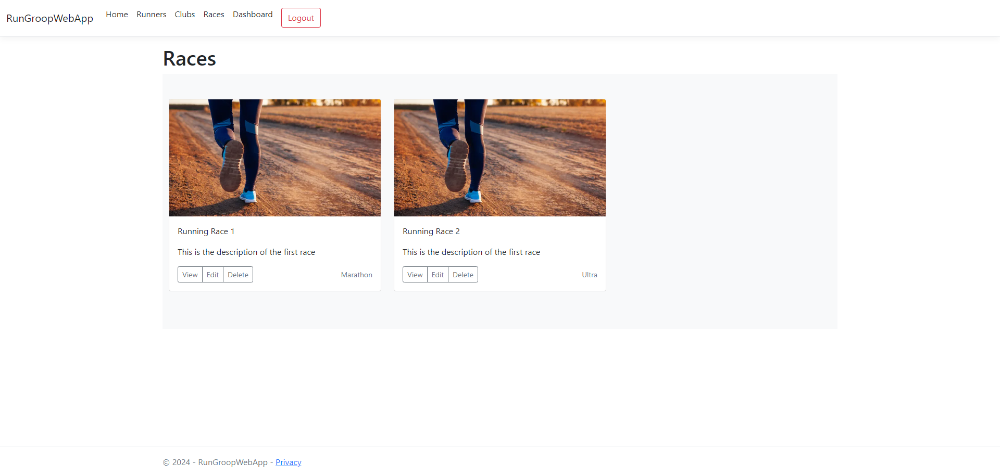
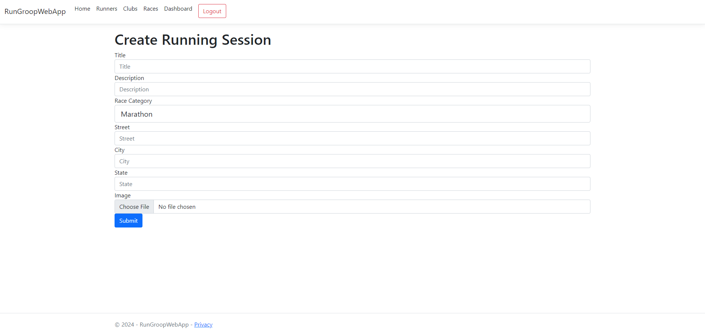

# RunGroopWebApp

A web application where users can create running clubs and running sessions.

<ul>
    <li>Integrated SQL Server for efficient database management.</li>
    <li>Utilized Entity Framework and LINQ to streamline database interactions.</li>
    <li>Developed responsive web pages using Razor and Bootstrap.</li>
    <li>Built Web APIs with ASP.NET Core to handle CRUD operations seamlessly.</li>
    <li>Implemented robust authentication and authorization protocols.</li>
    <li>Integrated third-party APIs to enhance the application’s functionality and improve automation.</li>
</ul>

